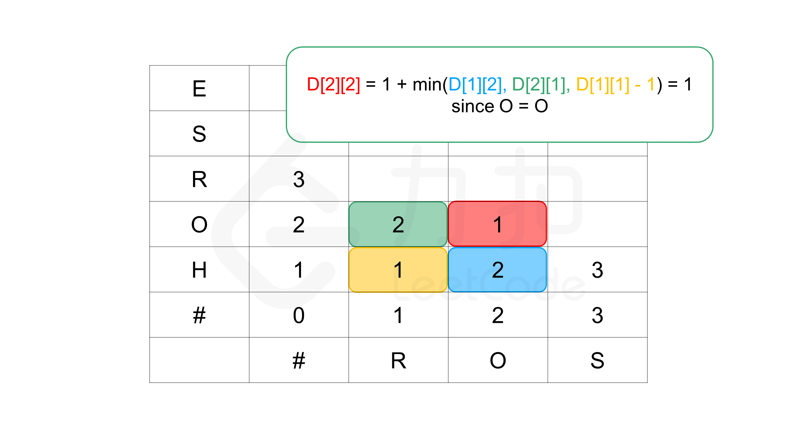

# EE538 Final Project - Fall 2022 - TrojanMap
#### contributors: Chengyu Lu
---
## Overview
The whole project is based on a map of an area near USC and corresponding information. All we have done is realizing  different functions of the system by using the data given in advance.

The whole map is constructed by nearly 20 thousand nodes. Each of them contains information about itself and its neighbors. The information is stored in an unordered_map `data`, while the key is the node's id and the value is the node itself, showed below.

```cpp
class Node {
 public:
  Node(){};
  Node(const Node &n) {
    id = n.id;
    lat = n.lat;
    lon = n.lon;
    name = n.name;
    neighbors = n.neighbors;
    attributes = n.attributes;
  };
  std::string id;    // A unique id assign to each point
  double lat;        // Latitude
  double lon;        // Longitude
  std::string name;  // Name of the location. E.g. "Bank of America".
  std::vector<std::string>
      neighbors;  // List of the ids of all neighbor points.
  std::unordered_set<std::string>
      attributes;  // List of the attributes of the location.
};
```
---

## Detailed description of each function
---
### Item 1 (AutoComplete)
We change the input string into pure lower case, and we go throgh all the elements in `data`. If a name of a node shares the same prefix with the input, we put it into the return vector.

#### Time complexity
O(m*n), m is the size of input, n is the size of `data`

#### Output
```shell
**************************************************************
* 1. Autocomplete                                             
**************************************************************

Please input a partial location:st
*************************Results******************************
Starbucks
Student Union (STU)
St. Francis Center - Food Bank
Starbucks 2
Starbucks 1
Stimson House
Strangers Rest Baptist Church
St Agnes Church
St. Johns Cathedral-Hope Net
St. Philips Episcopal Church
Starbucks 3
Stout Burger
Studio 423
**************************************************************
Time taken by function: 4 ms
```
---
### Item 2-1 (GetPosition)
The input is the location name, we find its location in `data`, and return it. Nothing tricky.

#### Time complexity
O(n), n is the size of `data`
#### Output
```shell
**************************************************************
* 2. Find the location                                        
**************************************************************

Please input a location:Ralphs
*************************Results******************************
Latitude: 34.0318 Longitude: -118.291
**************************************************************
Time taken by function: 1 ms
```
---
### Item 2-2 (EditDistance)
This part can be used it the situation where the user mistypes "Ralphs" into "Rolphs". We want to find a name int `data` that best matches the input.

First, we implement a function to calculate the editdistance of two words. The story can be explained by the minimum operations we need to take to transfer word1 into word2. This problem could be found in Leetcode No.72. Basically, we use dynamic programming method. We  store the result of the i-1 epoch, and refer to it when it comes to the i epoch. 

Let's take A = `horse` and B = `ros` as an example.The idea is like this: 

1. Since deleting a character in A is equal to adding a character in B, we only have the following three opertion types:

a. Inserting a character in A

b. Inserting a character in B

c. Changing a character in A

2. We do the three opertions below: 

a. If we know that the edit distance between `horse` and `ro` is a, the edit distance to `ros` could be no more than a+1, because all we have to do is adding a character in A.

b. If we know that the edit distance between `hors` and `ros` is b, the edit distance could be no more than b+1.

c. If we know that the edit distance between `hors` and `ro` is c, the edit distance could be no more than c+1.

We can use a 2D table to implement this idea of programming. The details are shown in the figures.

<p align="center"></p>

<p align="center"></p>


After implementing the `CalculateEditDistance` function, all we have to do is compare the input with each of the name in `data` and pick the closest name to the input.

#### Time complexity
`CalculateEditDistance`: O(mn), m is the size of word1, n is the size of word2
`FindClosestName`: O(kmn), k is the size of `data`
#### Output
```shell
**************************************************************
* 2. Find the location                                        
**************************************************************

Please input a location:Storbercks
*************************Results******************************
No matched locations.
Did you mean Starbucks instead of Storbercks? [y/n]y
Latitude: 34.0391 Longitude: -118.261
**************************************************************
Time taken by function: 2 ms
```
---
### Item 3 (GetAllCategories)
Getting all the catogories in `data`. Simply go through all the content of `data`.
#### Time complexity
O(mn), m is the size of the maximum size of the vector of categories, n is the size of `data`

#### Output
```shell
**************************************************************
* 3. Find all location categories                             
**************************************************************

*************************Results******************************
artwork
attraction
bakery
bank
bar
beauty
beverages
bicycle
bicycle_rental
bus_station
cafe
car
car_repair
car_wash
charging_station
childcare
clinic
clothes
confectionery
convenience
copyshop
dentist
department_store
driving_school
fabric
fast_food
food_court
fountain
fuel
gallery
hairdresser
hospital
hotel
library
marketplace
mobile_phone
museum
music
optician
parcel_locker
parking
parking_entrance
pharmacy
place_of_worship
police
post_box
post_office
restaurant
school
shoe_repair
shoes
skate
social_facility
supermarket
theatre
tobacco
yes
yoga
**************************************************************
Time taken by function: 3 ms
```
---
### Item 4 (GetAllLocationsFromCategory)
Given a category, return all the places' ids belonging to it. Simply go throgh all the elements in `data`.
#### Time complexity
O(mn), m is the size of the maximum size of the vector of categories, n is the size of `data`

#### Output
```shell
**************************************************************
* 4. Get all locations in a category                           
**************************************************************

Please input the category:supermarket
*************************Results******************************
7158034317
2578244375
6045067406
5237417649
**************************************************************
Time taken by function: 3 ms
```
---
### Item 5 (GetLocationRegex)
Getting all the ids in the `data` whose name matches the input regular expression. We simply use the std function to do this.
#### Time complexity
O(mn), m is the time complexity of the std function, n is the size of `data`

#### Output
```shell
**************************************************************
* 5. Get locations using a regular expression                 
**************************************************************

Please input the regular expression:(Hill)(.*)
*************************Results******************************
9596557992
9587039895
6279600804
9587039894
6279600805
6279600812
6123510350
4291108051
6123510349
6279600806
6279600807
6279600808
6279600811
6503044368
9598720154
**************************************************************
Time taken by function: 46 ms
```
---
### Item 6 (Shortest path)

+ Dijkstra implementation
Starting from the origin, we refresh the distances of its neighbors by shorter ones(if exist). And then we move to the node that has the shortest distance for now, regarding it as the origin. We do the similar things again and again, until we get to the destination, we pop out of the loop. We use a `lasts` vector to note the last node to this node who has the shortest distance to the origin.
We don't have to put the whole map into account, and we use a greedy way of proceeding. I think that is the main reason it is better than the Bellman-Ford.

#### Time complexity

O(m + n*log(n)), m is the number of edges, n is the number of location ids.

+ Bellman-Ford implementation
We simply do relaxation starting from the origin, repalcing the distance with shorter ones for the whole map. We do it again and again (maximum is n-1, n is the number of nodes) until there is no improvement. We use a `lasts` vector to note the last node to this node who has the shortest distance to the origin. I think the idea I describe here is a little bit different from what I saw in the slides about finding n-1 edges. But I think somehow they share the same bottom logic.

#### Time complexity

O(mn), m is the number of edges, n is the number of location ids.

+ Comparison

| Point A to Point B        | Dijkstra  | Bellman Ford  |
|---------------------------|-----------|---------------|
|Soles Bicycles to McClintock & Jefferson|6ms|21575ms|
|Parking Center to Chase|8ms|20078ms|
|Bank of America to Starbuck 2|16ms|19908ms|
|Department of Motor Vehicles to Leavey Library|20ms|21162ms|
|McDonalds to Burger King|24ms|22561ms|
|Village Cobbler to Ground Zero|29ms|21108ms|
|Everybodys Kitchen to Parkside Dining Hall|42ms|21491ms|
|Ralphs to Target|47ms|19180ms|
|Starbucks 2 to Holbox|70ms|20336ms|
|Popeyes to Ralphs|90ms|21559ms|
|Washington & Olive to Target|109ms|22116ms|
|The Barber Shop to Ralphs|121ms|31281ms|
|The Mirage to Oscars Printing|145ms|20769ms|
|Jostar to Tommy Trojan|182ms|29840ms|
|Dulce to Rossoblu|265ms|22553ms|
---
### Item 7 (Cycle detection)
In the lecture, the professor told us that DFS could be used to do cycle detection, so we use DFS to do the job. First, we store ids of all the elements in an unordered_map. We only consider the nodes inside this map. For one graph, we keep doing the deep search, if we find that one of the neighbor of the current node is in the map && it has been visited && it is not the previous node of the current node, there certainly exists a cycle in this graph. Notice that we might have multiple graphs in the square area, so the program must be able to start from an avalable node after an epoch.

#### Time complexity
O(mn), m is the number of nodes, n is the number of edges

#### Output
1.
```shell
**************************************************************
* 7. Cycle Detection                                          
**************************************************************

Please input the left bound longitude(between -118.320 and -118.250):-118.311
Please input the right bound longitude(between -118.320 and -118.250):-118.310
Please input the upper bound latitude(between 34.000 and 34.040):34.011
Please input the lower bound latitude(between 34.000 and 34.040):34.010
*************************Results******************************
there exist no cycle in the subgraph 
**************************************************************
Time taken by function: 0 ms
```
<p align="center"></p>


2.
```shell
**************************************************************
* 7. Cycle Detection                                          
**************************************************************

Please input the left bound longitude(between -118.320 and -118.250):-118.299
Please input the right bound longitude(between -118.320 and -118.250):-118.264
Please input the upper bound latitude(between 34.000 and 34.040):34.032
Please input the lower bound latitude(between 34.000 and 34.040):34.011
*************************Results******************************
there exists a cycle in the subgraph 
**************************************************************
Time taken by function: 16 ms
```
<p align="center"></p>

---

### Item 8 (Topological Sort)
For a Directed Acyclic Graph(DAG), we can find a topological sort of it, if it exists, by the following three steps:

1. Select a vertex without a precursor (that is, the degree of penetration is 0) from the DAG and put it into a vector.

2. Delete the vertex and all directed edges starting from it in the graph.

3. Repeat it until the graph is empty, then there exists a path; or if at some point there is no such a vertex, there must be a loop in the graph, so there is no topolpgical sort of it.

#### Time complexity
O(mn), m is the number of nodes, n is the number of edges

#### Output
1. Non-existing case
```shell
Name
Ralphs
Grand & Pico
Popeyes
```
```shell
Source, Destination
Grand & Pico,Ralphs
Ralphs,Popeyes
Popeyes,Grand & Pico
```
```shell
**************************************************************
* 8. Topological Sort                                         
**************************************************************

Please input the locations filename:/home/sdogsa/Documents/TrojanMap/fall2022_trojanmap-sunyisa/input/topologicalsort_locations.csv
Please input the dependencies filename:/home/sdogsa/Documents/TrojanMap/fall2022_trojanmap-sunyisa/input/topologicalsort_dependencies.csv
*************************Results******************************
There is no topological sort for the given graph.
**************************************************************
Time taken by function: 0 ms
```

2. Complex case
```shell
Name
Ralphs
Grand & Pico
Popeyes
Target
McDonalds 1
Burger King
McDonalds
Leavey Library
Parkside Dining Hall
Expo/Western
```
```shell
Source, Destination
Ralphs,Grand & Pico
Ralphs,Popeyes
Grand & Pico,Popeyes
Grand & Pico,McDonalds 1
Popeyes,Target
Target,Leavey Library
Popeyes,Leavey Library
McDonalds,McDonalds 1
McDonalds 1,Burger King
Leavey Library,McDonalds
Leavey Library,Expo/Western
Expo/Western,McDonalds
Expo/Western, Parkside Dining Hall
Burger King,Parkside Dining Hall
```
```shell
**************************************************************
* 8. Topological Sort                                         
**************************************************************

Please input the locations filename:/home/sdogsa/Documents/TrojanMap/fall2022_trojanmap-sunyisa/input/topologicalsort_locations.csv
Please input the dependencies filename:/home/sdogsa/Documents/TrojanMap/fall2022_trojanmap-sunyisa/input/topologicalsort_dependencies.csv
*************************Results******************************
Topological Sorting Results:
Ralphs
Grand & Pico
Popeyes
Target
Leavey Library
Expo/Western
McDonalds
McDonalds 1
Burger King
Parkside Dining Hall
**************************************************************
Time taken by function: 0 ms
```

<p align="center"></p>

---

### Item 9 (Traveling Trojan) 
+ Brute-force

This method is very staight-forward. We are trying to find the loop with minimum length. We pick one point as the origin, and try all the possible solution to find the minimum. For example, there are 4 points A, B, C and D. We set A as the origin, we have the following possibilities:

A-B-C-D-A

A-B-D-C-A

A-C-B-D-A

A-C-D-B-A

A-D-B-C-A

A-D-C-B-A

We go through all of them and find the minimum. The implementation is simple, we use recursive DFS to do the job.

#### Time complexity
O(n!), n is the number of nodes

+ Brute-force enhanced with early backtracking

The basic idea is the same with the first try. However, in the helper function, when we find that the length of the current path is already longer than the shortest path found, we return and skip this path. This is also called pruning.

#### Time complexity
O(n!), n is the number of nodes

+ 2-opt

We assume that the there exists a route already. The main idea is exchanging the nodes step by step as the code in wikipedia, refresh the path if it is shorter. 

#### Time complexity
O(n^2), n is the number of nodes

+ Comparison

| Number of nodes| Brute-force| Brute-force enhanced with early backtracking|2-opt Heuristic|
|----------|----------|----------|----------|
|3|0ms|0ms|0ms|
|4|0ms|0ms|0ms|
|5|0ms|0ms|1ms|
|6|6ms|3ms|1ms|
|7|34ms|12ms|2ms|
|8|153ms|75ms|2ms|
|9|1134ms|257ms|4ms|
|10|10554ms|1896ms|10ms|

---

### Item 10 (Find Nearby) 
The logic of the function is very straight-forward. The notes in the code explain everything crystal-clear. The process are as the follows:
1. Find the name of the center
2. Find all the nodes that have such category in `data`, and put those in the circle into the `res`
3. Sort `res` according to the distance so that the output would be from near to far.

#### Time complexity
O(mn), m is the number of nodes, n is the number of attributes in the nodes

#### Output
```shell
**************************************************************
* 10. Find Nearby                                              
**************************************************************

Please input the attribute:supermarket
Please input the locations:KFC
Please input radius r:10
Please input number k:10
*************************Results******************************
Find Nearby Results:
1 Cal Mart Beer & Wine Food Store
2 Trader Joes
3 Ralphs
4 Food 4 Less
**************************************************************
Time taken by function: 66 ms
```

<p align="center"></p>

---
### Item 11 (TrojanPath)
The idea is using the similar structure like the Brute-force method enhanced with early backtracking, replacing the `CalculateDistance` function in the helper function with `CalculateShortestPath_Dijkstra` function. The implementation is similar with Item 6.

#### Time complexity
O(k! * (m + n*log(n))), k is the number of stop points, m is the number of edges between two stop points, n is the number of nodes between two stop points.

#### Output
```shell
**************************************************************
* 11. Shortest Path to Visit all Nodes                        
**************************************************************

Please input the locations filename:/home/sdogsa/Documents/TrojanMap/fall2022_trojanmap-sunyisa/input/locations.csv
*************************Results******************************
"1759017528","358789632","6653019473","6653019472","6653019478","6653019479","6814990119","1870797772","348123012","1870795202","1870797850","1870797915","1870786047","1837208747","1837208745","348123009","1870787369","348122895","348122893","1870783073","6815813001","1870783149","1870787415","269635717","269635684","1837206577","269635682","269635727","6805760713","6805760716","123280946","6805760719","6790392176","8201681436","1855120255","6820982886","269633021","6820972482","4872886234","4872886233","4872886231","6655857589","4872886231","4872886233","4872886234","7211629027","6815182444","544348508","441893821","123280934","4012759746","4012759747","123292045","123292100","9591449436","9591448315","9591449440","9591448316","9591449417","9591449437","9591449418","4011837222","1841835282","122855868","63785495","5680945549","2613157014","4835551230","6813565299","6813565300","6813565293","6813565301","6813565302","4835551232","4835551104","4012842272","4835551103","6814916544","6813565307","4835551098","4835551099","4835551100","3088547686","4835551100","4835551097","4835551101","4835551096","2613117890","2613117915","4835551105","6813565334","2613117867","6787803635","6807905595","6813379406","2613117879","3398578893","3398574892","6813565290","3398578898","6813379398","6813379505","6813379519","4399698005","3398578900","4399698015","6813379425","3398578901","6813379479","6813379584","6814769289","5237417650","6814769289","6396649383","9591449485","6814769290","6814820018","6814820010","6814820015","9591449515","6813379419","6047234443","6813379418","6045054380","6818390143","6818390139","6818390142","6818390141","3402887079","4091160823","4091160830","4091160831","4091160832","6808200833","6808200837","6808200834","6808200835","6808200836","4399693642","6808200836","6808200835","6808200834","6808200837","6808200833","6808200832","6352860083","1286136440","21098539","4015203133","4015203134","4015203136","123152294","6816193786","6816193785","6808069740","6813416155","6813416151","6813416152","6813416153","6813416154","6813416145","7232024780","6818427916","6818427917","6818427898","6818427892","6818427918","6818427919","6818427920","4380040148","4380040152","4380040153","4380040154","2578244375",
The distance of the path is:3.24104 miles
Time taken by function: 99381 ms
```

<p align="center"></p>


## Conclusion
In this course, the first part is the basic knowledge of software engineering. We want our programs to be readable, so we write note to make it clear for others as well as ourselves. Essentially, we are requiered to write unit tests for every function we write, and I think it is a vital part for any project, especially those related to codes. In this project, though we didn't do that much, we have a brief taste of how to make a software, and to make it easy to read and maitain.

The second part is the C++ language itself. Unlike Java or Python, we could face unexpected errors like memory leak in C++. However, C++ is definitely much more efficient than most advanced languages. I practiced my C++ programing during the homework and project, and I think it helps a lot.

A very important part of this course is the data structure. We learn basic data structures, like array, queue, stack, and complex ones like tree and graph. In this project, for exmample, at first I used four vectors to implement the Dijkstra algorithm. Personally I think this is the more staight-forward way. However, after I finished the rest part of the project, I noticed that in Item 11 when the Dijkstra function is called, the whole thing is not efficient enough. I want the Dijkstra function to be more efficient because it is called over and over again. I change the data structure from vectors to priority queue, and the running time is cut from 500 ms or so to no more than 50ms, a big improvement.

We alse implement some graph algorithms in the project. From Dijkstra to Bellman-Ford, and Brute-Force to 2-opt, I do realize that a better design of algorithm will make the code more efficient, though sometimes the algorithm may seem to be incomprehensible. The process of transforming ideas into executable codes practiced my coding skills.

In conclusion, the TrojanMap works out fine, and I and my teammate learned a lot in the project as well as the course. Thank you for your effort and patience, it helps a lot!
